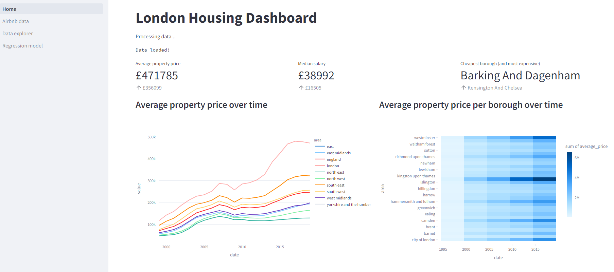
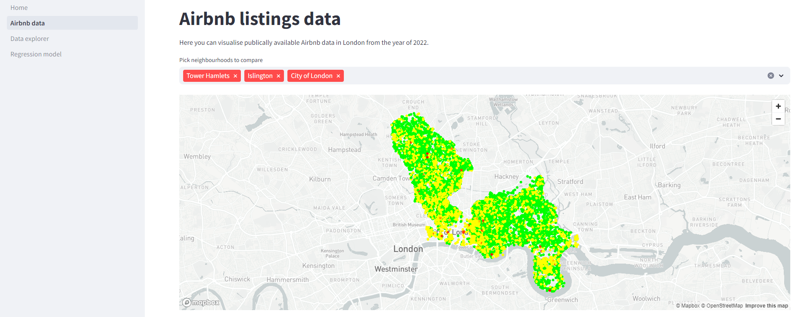
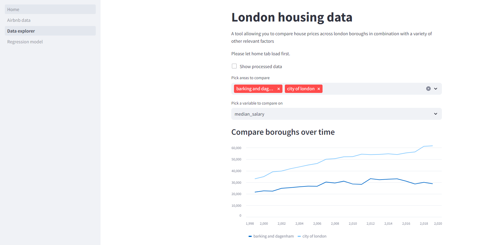
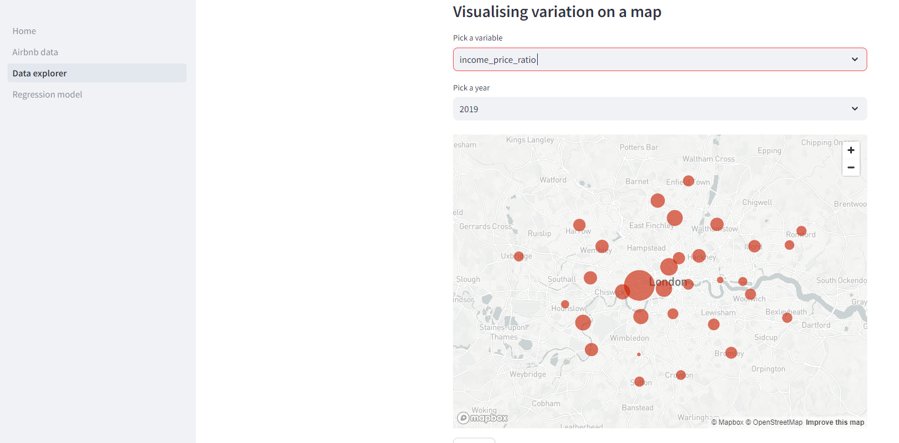

# What is this project about?
Inspired by the city dashboard project by Maynooth University, I decided to create a city dashboard for London. The intention here is creating an accessible, interactive and flexible dashboard that provides an overview over a city for interested citizens, urban planners, and sociological researchers. The potential variables to include are limitless, so I have restricted myself here to data on housing prices, rental prices, airbnb rental prices, income levels and satisfaction levels.

# How does it work?
Data was sourced from a variety of sources: The majority was retrieved from London DataStore, an open data-sharing portal hosting data from the Greater London Authority, Airbnb data was available on Kaggle, and borough geographical information was scraped from wikipedia. The data was extracted from the respective sources, transformed into a comprehensive datatable, and then loaded onto a Google Cloud instance, to be queried using SQL later. It was built in Streamlit, to allow for quick development of ideas in a Python-native environment.

# Images

